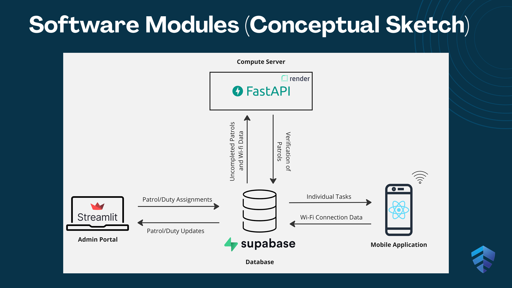

Built a system of automated verification of campus patrols using access point connectivity data. The project aimed to strengthen the strength of campus security by streamlining the process by ensuring trust among the several stakeholders. It was built using React Native for the mobile phone application, which sent the connectivity data to a SQL (Supabase) database. A FastAPI server periodically fetched data from the database to verify the patrols according to the schedule uploaded via the admin portal (built in Streamlit).
# Screenshot of Application

